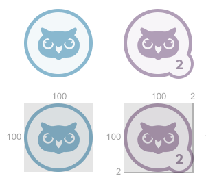

# Тестовое задание

Решите задания и добавьте ссылки на решения в форму регистрации.

# Задание 1

Представьте, что каждый сотрудник компании имеет свою страницу на внутреннем корпоративном сайте. На каждой странице должен появится список с ачивками — знаками сотрудника о каких-то достижениях. Макет находится [тут](template.png).



Сверстайте шаблон для списка ачивок без применения SVG. Должны выполняться такие требования:

* на каждой странице может быть до 100 ачивок;
* на каждой ачивке должен быть номер в зависимости от того, какой по счёту она получена;
* внешний вид ачивок можно менять добавлением класса к DOM-элементам;
* любую картинку можно вставить внутрь ачивки.

Результат пришлите в виде ссылки на исходный код на GitHub.

## Что мы проверяем этим заданием

Вы должны продемонстрировать, что знаете современный CSS и умеете применять знания на практике. Также важно увидеть, что вы знаете подходы к повторному использованию кода и понимаете, как дальше работают с HTML для шаблонизации.

# Задание 2

Создайте Node.js модуль, который будет обфусцировать CSS классы. В качестве данных модуль должен принимать массив строк. Пример можно увидеть тут.

Модуль должен возвращать объект с ключами в виде имён классов, и в качестве значения — новое значение имени класса. Например,

```javascript
{
  class1: 'a', 
  class2: 'b'
}
```

Сам модуль должен выглядеть так:
```javascript
/**
  * @param {Array} data – массив CSS классов
  */
module.exports = function(data) {
  // Ваш код
};
```
Новые имена классов должны начинаться только с латинских символов и могут содержать - и _ , а также цифры. Должно быть однозначное соответствие между старым именем и новым именем класса.

Для реализации обфускатора не должны использоваться сторонние библиотеки.
Дополнение к заданию:

Сделайте так же минификацию классов.

Чаще встречающиеся имена классов после обфускации должны иметь наименьшую длину ( в частности наиболее часто встречающиеся имена классов будут представлены одним символом).

Результат пришлите в виде ссылки на исходный код на GitHub.

## Что мы проверяем этим заданием

Оцениваться будет качество кода, а также наличие документации и тестов.
